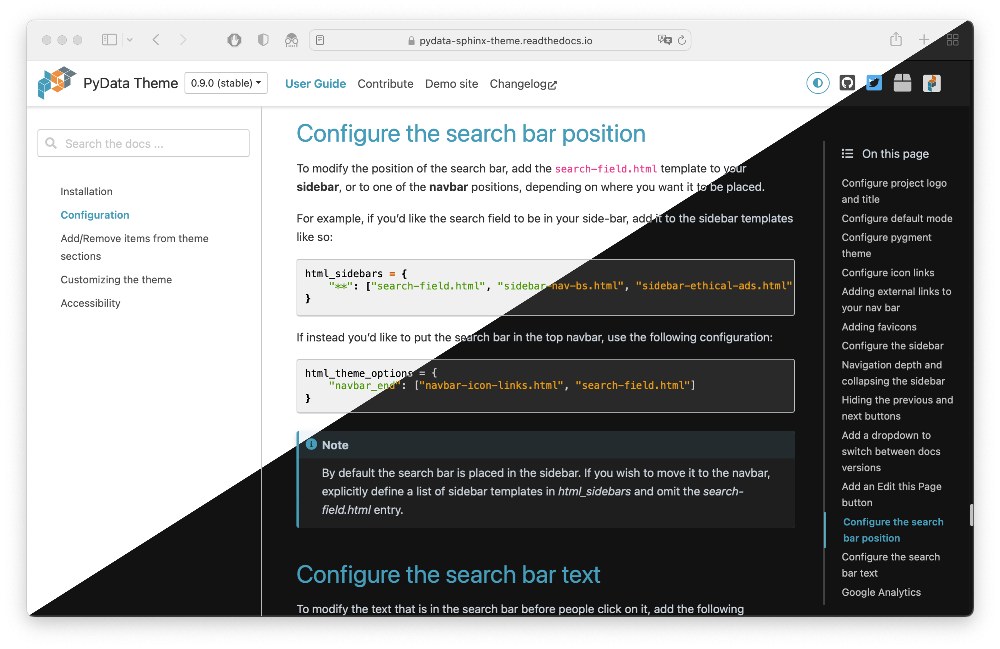

# The PyData Sphinx Theme

[](https://pypi.org/project/pydata-sphinx-theme/)
[](https://anaconda.org/conda-forge/pydata-sphinx-theme)
[](https://github.com/pydata/pydata-sphinx-theme/actions/workflows/tests.yml)
[](https://readthedocs.org/projects/pydata-sphinx-theme/builds/)
[](https://codecov.io/gh/pydata/pydata-sphinx-theme)

A clean, three-column, Bootstrap-based Sphinx theme by and for the [PyData community](https://pydata.org).

- 📚 Documentation: https://pydata-sphinx-theme.readthedocs.io/en/stable
- 💡 Examples: https://pydata-sphinx-theme.readthedocs.io/en/stable/examples
- 🙌 Contribute: https://pydata-sphinx-theme.readthedocs.io/en/stable/community

[](https://pydata-sphinx-theme.readthedocs.io/en/stable)

## Installation and usage

The theme is available on PyPI and conda-forge. You can install
and use as follows:

- Install the `pydata-sphinx-theme` in your doc build environment:

  ```
  pip install pydata-sphinx-theme
  # or
  conda install pydata-sphinx-theme --channel conda-forge
  ```

- Then, in the `conf.py` of your sphinx docs, you update the `html_theme`
  configuration option:

  ```
  html_theme = "pydata_sphinx_theme"
  ```

And that's it!

> **Note**
> This theme may not work with the latest major versions of Sphinx, especially
> if they have only recently been released. Please give us a few months of
> time to work out any bugs and changes when new releases are made.
> See [our contributing documentation](docs/community/topics.md) for more information.

## Contribute to and develop the theme

Contributions are very welcome! Installing the development version, building
the example docs and developing the css/js of the theme, etc, is explained in
more detail in the contributing section of the documentation:

- [Community and contributing documentation](https://pydata-sphinx-theme.readthedocs.io/en/latest/community/index.html)
