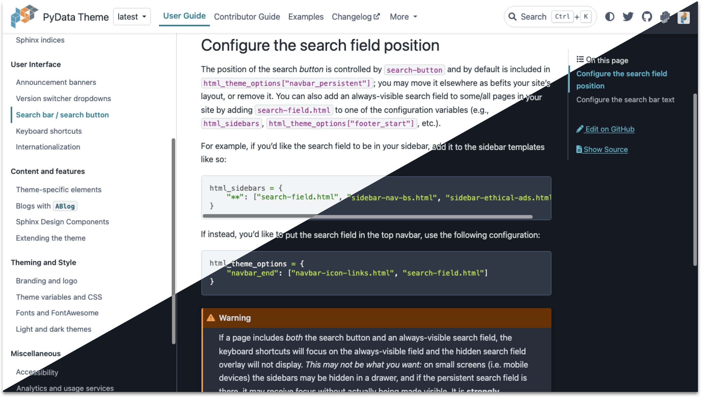

# The PyData Sphinx Theme

[](https://github.com/pydata/pydata-sphinx-theme/blob/main/LICENSE)
[](https://pypi.org/project/pydata-sphinx-theme/)
[](https://anaconda.org/conda-forge/pydata-sphinx-theme)
[](https://github.com/pydata/pydata-sphinx-theme/actions/workflows/CI.yml)
[](https://readthedocs.org/projects/pydata-sphinx-theme/builds/)

A clean, three-column, Bootstrap-based Sphinx theme by and for the [PyData community](https://pydata.org).

- :books: Documentation: https://pydata-sphinx-theme.readthedocs.io/en/stable
- :bulb: Examples: https://pydata-sphinx-theme.readthedocs.io/en/stable/examples
- :raised_hands: Contribute: https://pydata-sphinx-theme.readthedocs.io/en/stable/community
- :globe_with_meridians: Translate: https://explore.transifex.com/12rambau/pydata-sphinx-theme/

[](https://pydata-sphinx-theme.readthedocs.io/en/stable)

## Installation and usage

The theme is available on PyPI and conda-forge. You can install
and use as follows:

- Install the `pydata-sphinx-theme` in your doc build environment:

  ```bash
  pip install pydata-sphinx-theme
  # or
  conda install pydata-sphinx-theme --channel conda-forge
  ```

- Then, in the `conf.py` of your sphinx docs, you update the `html_theme`
  configuration option:

  ```python
  html_theme = "pydata_sphinx_theme"
  ```

And that's it!

> [!NOTE]
> This theme may not work with the latest major versions of Sphinx, especially
> if they have only recently been released. Please give us a few months of
> time to work out any bugs and changes when new releases are made.
> See [our contributing documentation](https://pydata-sphinx-theme.readthedocs.io/en/stable/community/practices/versions.html#supported-sphinx-versions) for more information.

## Contribute to and develop the theme

Contributions are very welcome! Installing the development version, building
the example docs and developing the `CSS/JS` of the theme, etc., is explained in
more detail in the contributing section of the documentation:

- [Community and contributing documentation](https://pydata-sphinx-theme.readthedocs.io/en/latest/community/index.html)

## FontAwesome payload plan

<details>
<summary>Plan: shrink FontAwesome payload, keep custom-icon API</summary>


## Where we are today

Each docs page downloads three FontAwesome assets:

- `scripts/fontawesome.js` (~1.5 MB) — this is FA's `js/all.min.js`. It ships
  every free icon as JS and, at load time, rewrites every `<i class="fa-...">`
  into an inline `<svg>`.
- Two `.woff2` webfonts (~100 KB each) — pulled in by the SCSS, which already
  `@import`s FontAwesome's solid / regular / brands stylesheets.

So we currently ship **both** delivery methods and only use one. The webfonts
are downloaded but the JS wins: it replaces the `<i>` tags with SVG before the
font is ever needed.

Two problems come from the JS:
1. It is huge (1.5 MB for a handful of icons).
2. The `<i>` → `<svg>` swap happens after paint, causing layout jump / flicker.

We can't just delete the JS, because our custom icons (e.g. the PyPI icon) are
registered through `FontAwesome.library.add(...)` and rendered as SVG. The
webfont has no glyph for them.

## The idea

Standard icons already work through CSS + WOFF — that stays and becomes the only
path for them. Drop `all.min.js` entirely. Replace it with a small JS bundle
built from `@fortawesome/fontawesome-svg-core` that:

- exposes the same `window.FontAwesome` global with `library.add` (and `dom`,
  `config`, `icon`, `parse`) so user `custom-icons.js` files keep working
  unchanged;
- disables the global auto-replace (`config.autoReplaceSvg = false`, no
  `dom.watch()` mutation observer), so it never touches standard `<i>` tags and
  never causes flicker;
- on `DOMContentLoaded`, runs `dom.i2svg()` scoped to `i.fa-custom` only, so
  just the custom icons become SVG. `DOMContentLoaded` fires after deferred
  scripts, so it runs after the user's `library.add` call.

Expected size: svg-core is tens of KB instead of 1.5 MB, and only custom-icon
`<i>`s ever swap to SVG (usually one or two per page), so no visible flicker.

## What changes

- `assets/scripts/fontawesome.js` — stop importing `js/all.min.js`; import from
  `fontawesome-svg-core`, set config, expose the global, add the scoped
  `i2svg` on DOM ready.
- `docs/_static/custom-icons.js` — no change needed (still calls
  `FontAwesome.library.add`), but confirm it still renders.
- SCSS — no structural change; the FA `@import`s stay. Optional: drop the
  `regular` import if nothing uses it, to shave one woff (skip if unsure, to
  stay safe).
- `webpack.config.js` — bundle stays the same entry; verify the smaller output.
- Docs (`user_guide/header-links.rst`) — the "custom colors" hint targets
  `svg.fa-square-twitter`; standard icons are now `<i>`, so update the example
  to target `i.fa-square-twitter` (or the class alone).

## Accepted, known side effect

Standard icons stop being `<svg>` and stay `<i>` webfont glyphs. Any CSS that
selected `svg.fa-...` for a standard icon must move to `i.fa-...`. This is fine
per the request. Custom icons stay `<svg>` so their existing styling is
unaffected.

## No-regression checklist

Verify each of these still renders correctly and looks the same after the change:

- Navbar icon links, standard FA (`fa-brands fa-github`, etc.) — now webfont.
- Navbar icon links, custom (`fa-custom fa-pypi`, `fa-pydata`) — still SVG via
  `library.add`.
- `github_url` / `gitlab_url` shortcut icons.
- Theme switcher (sun / moon / half-circle), search buttons, "on this page"
  list icon, prev/next angles, breadcrumbs home, edit-this-page pencil, show
  source, back-to-top arrow.
- Admonition icons (note, warning, tip, ...) — CSS `::before` pseudo-elements,
  never used JS, should be untouched.
- versionmodified, download span, external-link marker, ablog arrows,
  sidebar external-link `::before` — all CSS pseudo-elements, confirm intact.
- `fa-lg` / `fa-fw` sizing still applies to webfont `<i>`.
- sphinx-design dropdown icons — its own octicon SVGs, independent of FA JS.
- User custom-icons workflow end to end: `FontAwesome.library.add` global
  exists, custom icon appears, `.fa-<name>` CSS hook still works.
- No FA JS console errors; only custom `<i>` become `<svg>`, standard ones stay.
- Confirm `all.min.js` is gone from the built output and total FA payload
  dropped from ~1.7 MB to the webfonts plus a small svg-core bundle.

## Open questions (please confirm)

- OK to keep the `regular` webfont import for safety, or should we try to drop
  unused weights to save a file?
- Any downstream sites known to rely on standard icons being `<svg>` (custom
  CSS) that we should call out in release notes / migration guide?

</details>
