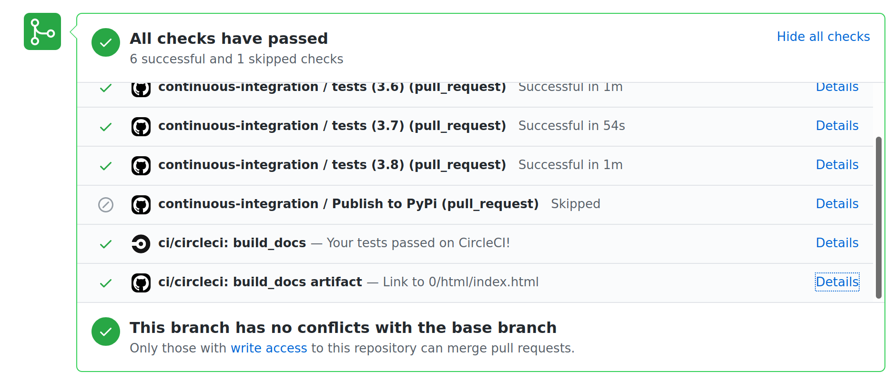

************
Contributing
************

The documentation of the theme (what you are looking at now) also serves
as a demo site for the theme. In the top-level "Demo site" section,
more pages with typical sphinx content and structural elements are included.

Installing
==========

To get this demo site up and running, you first need to install the requirements:
``/doc/requirements.txt`` (with for example pip or conda).

Then, you need to install the sphinx theme (the theme itself is a python package).
When developing, the easiest is to install it in "development" or "editable" mode,
which means you can make changes in the repo and directly test it with the docs.
To install, you can run this from the root of the repo::

    pip install --editable .

Building the demo docs
======================

For the tradiditional sphinx-way to build the demo site, navigate to the
`docs/` directory, and then run::

    make html

This will trigger sphinx to build the html version of the site. The output can
be found in the ``docs/_build/html`` directory.

However, when you want to edit the css/js sources, those need to be bundled
and the workflow for this is explained in the next section.

Theme development
=================

The css and javascript part of this theme is bundled via Webpack. In ``./src/*``
the theme related stylesheets and javascript is located. 2 entrypoints are
available:

- Stylesheet: ``./src/scss/index.scss``
- Javascript: ``./src/js/index.js``

Both entrypoints will be bundled into ``./pydata_sphinx_theme/static/{css,js}``.

Theme development was inspired by the `ReadTheDocs sphinx theme <https://github.com/readthedocs/sphinx_rtd_theme>`__.

Steps to develop the theme
--------------------------

1. Install yarn
2. Install theme dependencies
3. Run development server
4. Build production assets

**Important:** in order to commit changes to the theme, ensure you run
``yarn build:production`` so all assets will be bundled into
``./pydata_sphinx_theme/static/``.

Install yarn
^^^^^^^^^^^^

`Yarn <https://yarnpkg.com>`__ is a package manager we use for managing
Javascript and CSS dependencies.

Install via conda::

    conda install yarn

Install alternative: https://classic.yarnpkg.com/en/docs/install.

Install theme dependencies
^^^^^^^^^^^^^^^^^^^^^^^^^^

Install theme related dependencies::

    yarn install

Run development server
^^^^^^^^^^^^^^^^^^^^^^

::

    yarn build:dev

A development server is available at http://localhost:1919. When working
on the theme, like editing stylesheets, javascript, .rst or .py files
every save reloads the development server. This reload includes bundling
stylesheets, javascript, and running sphinx again.

The following files will be watched and reloaded on change:

- ./src/js/index.js
- ./src/scss/index.scss
- ./docs/\*\*/\*.rst
- ./docs/\*\*/\*.py

Build production assets
^^^^^^^^^^^^^^^^^^^^^^^

To build the new theme assets into the theme, run the following command.

::

    yarn build:production

Contributing changes
====================

We follow the typical GitHub workflow of forking a repo, creating a branch,
opening pull requests (https://guides.github.com/introduction/flow/).

For each pull request, the demo site gets build to make it easier to preview
the changes in the PR. To access this, click on "Details" of the "build_docs artifact"
job of Circle CI:

Ensuring correct commits with pre-commit hooks
==============================================

To ensure all source files have been correctly build, a `pre-commit <https://pre-commit.com/>`__
hook is available to use.

To set this up, first install the ``pre-commit`` package::

    # with pip
    pip install pre-commit
    # or with conda
    conda install pre-commit -c conda-forge

and then running from the root of this repo::

    pre-commit install

Now all of the checks will be run each time you commit changes.

Note that if needed, you can skip these checks with ``git commit --no-verify``.
